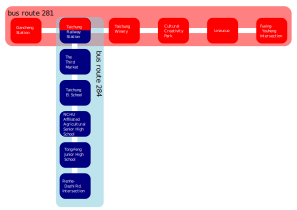

# Data

The example is a simple bus group which contains collection of bus data.

There are 2 bus routes with 11 unique bus stop.

**route:r281**
|index|Latitude|Longitude|Bus Stop Name|
|-----|-----|-----|-----|
|1|24.1409|120.686|Gancheng Station|
|2|24.1379|120.685|Taichung Railway Station|
|3|24.1341|120.682|Taichung Winery (Fuxing Rd.)|
|4|24.1332|120.68|Cultural Creativity Park|
|5|24.1319|120.677|Linzucuo|
|6|24.1314|120.676|Fuxing-Youheng Intersection|

**route:r284**
|index|Latitude|Longitude|Bus Stop Name|
|-----|-----|-----|-----|
|1|24.1379|120.685|Taichung Railway Station|
|2|24.133|120.684|The Third Market|
|3|24.1303|120.685|Taichung  El. School|
|4|24.1275|120.685|NCHU Affiliated Agricultural Senior High School(Taichung Rd.)|
|5|24.1264|120.686|Tong-Feng Junior High School|
|6|24.1264|120.69|Renhe-Dazhi Rd. Intersection|

Note: The r281#2 and r284#1 are same bus stop. (with same lat/lng and bus name)
